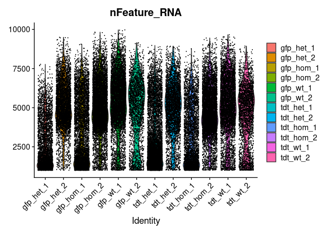
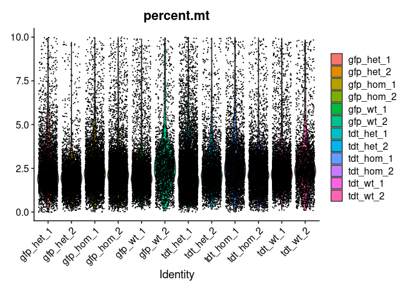
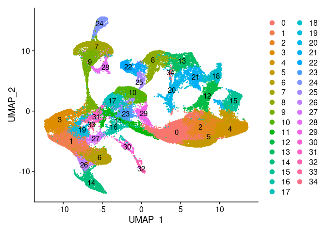
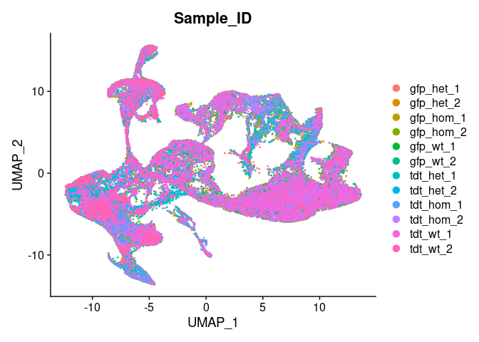
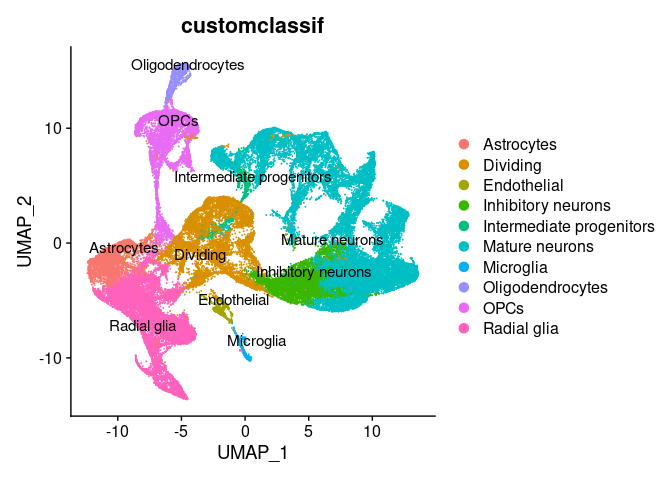
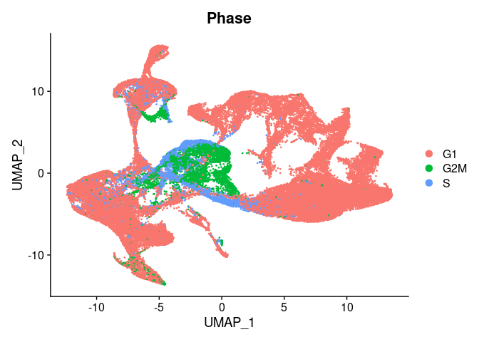
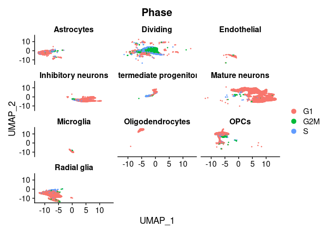

P5 SC-RNA-seq preprocessing and cell annotation
================
Rebecca Eliscu
2023-07-31

Setup:

``` r
library(dplyr)
```

    ## 
    ## Attaching package: 'dplyr'

    ## The following objects are masked from 'package:stats':
    ## 
    ##     filter, lag

    ## The following objects are masked from 'package:base':
    ## 
    ##     intersect, setdiff, setequal, union

``` r
library(Matrix)
library(Seurat)
```

    ## Attaching SeuratObject

    ## Attaching sp

``` r
library(data.table)
```

    ## 
    ## Attaching package: 'data.table'

    ## The following objects are masked from 'package:dplyr':
    ## 
    ##     between, first, last

``` r
library(HGNChelper)
## Note: Will run QC steps on samples in parallel using 'future_lapply' function:
library(future.apply)
```

    ## Loading required package: future

``` r
options(future.globals.maxSize=Inf)
plan(multicore, workers=10)
```

    ## Warning in supportsMulticoreAndRStudio(...): [ONE-TIME WARNING] Forked
    ## processing ('multicore') is not supported when running R from RStudio
    ## because it is considered unstable. For more details, how to control forked
    ## processing or not, and how to silence this warning in future R sessions, see ?
    ## parallelly::supportsMulticore

## Step 1:

### QC for count data:

### 1) Remove cells with \< 1,000 UMIs

### 2) Remove cells with \> 10% mitochondrial reads

### 3) Remove cells expressing \< 1,000 genes

### 4) Remove cells \> .999 percentile of # expressed genes

### 5) Remove cells with novelty \< .8 (\~# genes detected per UMI)

### 6) Remove zero variance genes

Using Mito genes from MitoCarta:

``` r
mito_genes <- fread("/mnt/bdata/rebecca/collabs/ghashghaei/SC_expr/E17/counts/Mouse.MitoCarta2.0.txt", data.table=F)
mito_genes <- mito_genes[is.element(mito_genes$TrainingDataset, "Tmito"),]
```

CellRanger output directories:

``` r
samples <- list.dirs(path="/mnt/bdata/rebecca/collabs/ghashghaei/SC_expr/P5/aligned_reads", recursive=F)
```

Running QC for each sample:

``` r
home_dir <- "/mnt/bdata/rebecca/collabs/ghashghaei/SC_expr/P5/counts/samples"
setwd(home_dir)
future_lapply(1:length(samples), function(i){
  sample_id <- sapply(strsplit(samples[i], "/", fixed=T), function(x) x[length(x)])
  print(sample_id)
  setwd(file.path(samples[i], "outs/raw_feature_bc_matrix"))
  if(any(grepl("gz", list.files()))) system("gunzip *.gz")
  expr <- readMM("matrix.mtx")
  genes <- fread("features.tsv", header=F, data.table=F)
  barcodes <- fread("barcodes.tsv", header=F, data.table=F)
  colnames(expr) <- barcodes[,c(1)]
  ## 1) Remove cells with < 1000 UMIs:
  n_umis <- colSums(expr)
  expr <- expr[,n_umis >= 1000]
  pdf(file=paste0(home_dir, "/", sample_id, "_QC.pdf"))
  n_umis <- colSums(expr)
  n_genes <- apply(expr, 2, function(x) sum(x > 0))
  plot(n_umis, n_genes, main=paste(sample_id, "\n", ncol(expr), "cells (>= 1000 UMIs/cell)"))
  hist(n_genes, breaks=100, main=paste(sample_id, "\n", ncol(expr), "cells (>= 1000 UMIs/cell)"))
  ## 2) Remove cells with > 10% mitochondrial reads
  mito_expr <- expr[tolower(genes[,c(2)]) %in% tolower(mito_genes$Symbol),]
  mito_expr <- colSums(mito_expr)/colSums(expr)
  expr <- expr[, mito_expr <= .1]
  ## 3) Remove cells expressing < 1000 genes:
  n_genes <- apply(expr, 2, function(x) sum(x > 0))
  expr <- expr[,n_genes >= 1000]
  n_genes <- apply(expr, 2, function(x) sum(x > 0))
  ## 4) Remove cells > .999 percentile of # expressed genes:
  expr <- expr[,n_genes <= quantile(n_genes, .999)]
  ## 5) Remove cells with "novelty" < .8
  n_umis <- colSums(expr)
  n_genes <- apply(expr, 2, function(x) sum(x > 0))
  novelty <- log10(n_genes)/log10(n_umis)
  expr <- expr[,novelty >= .8]
  ## 6) Remove zero variance genes:
  index <- rowSums(expr) > 0
  expr <- expr[index,]
  genes <- genes[index,]
  ## Plot final results:
  n_umis <- colSums(expr)
  n_genes <- apply(expr, 2, function(x) sum(x > 0))
  plot(n_umis, n_genes, main=paste(sample_id, "\n", ncol(expr), "cells,", nrow(genes), "genes"))
  dev.off()
  ## Make barcodes unique:
  colnames(expr) <- paste0(sample_id, "_", colnames(expr))
  ## Save:
  setwd(home_dir)
  fwrite(data.frame(genes), file=paste0(sample_id, "_genes_QC.tsv"), col.names=F)
  fwrite(data.frame(colnames(expr)), file=paste0(sample_id, "_barcodes_QC.tsv"), col.names=F)
  writeMM(expr, file=paste0(sample_id, "_expression_QC.mtx"))
})
```

Merge QC samples into single expression matrix:

``` r
setwd("/mnt/bdata/rebecca/collabs/ghashghaei/SC_expr/P5/counts/samples")
expr_paths <- list.files(path=getwd(), pattern=".mtx", full.names=T, recursive=F)
expr_list <- lapply(1:length(expr_paths), function(i){
  expr <- readMM(expr_paths[i])
  expr <- as(expr, "matrix")
  genes <- fread(gsub("expression_QC.mtx", "genes_QC.tsv", expr_paths[i]), header=F, data.table=F)
  barcodes <- fread(gsub("expression_QC.mtx", "barcodes_QC.tsv", expr_paths[i]), header=F, data.table=F)
  if(any(duplicated(genes[,c(2)]))){
    ## Select duplicate gene with highest mean expression:
    mean_expr <- genes %>%
      dplyr::mutate(Idx=1:n(), Mean=rowMeans(expr)) %>%
      dplyr::group_by(V2) %>%
      dplyr::slice_max(order_by=Mean, with_ties=F)
    expr <- expr[mean_expr$Idx,]
    genes <- genes[mean_expr$idx,]
  }
  colnames(expr) <- barcodes[,c(1)]
  return(data.frame(Gene=genes[,c(2)], expr))
})

expr_merge <- Reduce(f=function(x, y){
  merge(x, y, by="Gene")
}, expr_list)

fwrite(expr_merge, file="../expression_QC.csv")
```

## Annotate cell types

### Ref: <https://satijalab.org/seurat/articles/sctransform_v2_vignette.html>

Set up:

``` r
## Seting WD for all subsequent code chunks:
knitr::opts_knit$set(root.dir="/mnt/bdata/rebecca/collabs/ghashghaei/SC_expr/P5/cluster")
source("/home/rebecca/code/misc/upper_first.R") ## Custom function converts first character of string to upper case, rest lowercase
```

``` r
## Merged QC counts for all samples:
expr <- readRDS("../counts/expression_QC.RDS")
## Sample metadata:
sampleinfo <- read.csv("../sampleinfo_SC_P5.csv")
sampleinfo
```

    ##    Sample_ID Genotype Protein EGFR_Status
    ## 1  gfp_het_1      het     GFP        Null
    ## 2  gfp_het_2      het     GFP        Null
    ## 3  gfp_hom_1      hom     GFP        Null
    ## 4  gfp_hom_2      hom     GFP        Null
    ## 5   gfp_wt_1       wt     GFP          WT
    ## 6   gfp_wt_2       wt     GFP          WT
    ## 7  tdt_het_1      het     TDT          WT
    ## 8  tdt_het_2      het     TDT          WT
    ## 9  tdt_hom_1      hom     TDT        Null
    ## 10 tdt_hom_2      hom     TDT        Null
    ## 11  tdt_wt_1       wt     TDT          WT
    ## 12  tdt_wt_2       wt     TDT          WT

Format count data and metadata:

``` r
## Prep metadata:
sample_ids <- sapply(strsplit(colnames(expr), "_"), function(x) paste(x[-length(x)], collapse="_"))
cellinfo <- data.frame(Cell_ID=colnames(expr), Sample_ID=sample_ids)
cellinfo <- merge(cellinfo, sampleinfo, by="Sample_ID", sort=F)
rownames(cellinfo) <- cellinfo$Cell_ID
```

Create Seurat object:

``` r
expr <- CreateSeuratObject(counts=expr, meta.data=cellinfo, row.names=genes)
expr[["percent.mt"]] <- PercentageFeatureSet(expr, pattern="^mt-")
expr$Group <- paste(expr$Genotype, expr$Protein)
## Subset to cells with < 10% mitochondrial reads:
expr <- subset(expr, subset=percent.mt < 10)
```

Visualize reads and features per sample:

``` r
VlnPlot(expr, group.by = "Sample_ID", features = "nFeature_RNA", pt.size = 0.1)
```

<!-- -->

``` r
VlnPlot(expr, group.by = "Sample_ID", features = "percent.mt", pt.size = 0.1)
```

<!-- -->

How many cells per experimental group?

``` r
table(expr$Group)
```

    ## 
    ## het GFP het TDT hom GFP hom TDT  wt GFP  wt TDT 
    ##    9279   12208   13137   10680    7958    8044

Median number reads per nucleus:

``` r
median(expr$nCount_RNA)
```

    ## [1] 15191

Median number of genes expressed per nucleus:

``` r
median(expr$nFeature_RNA)
```

    ## [1] 4457

No. genes and cells in total:

``` r
dim(expr)
```

    ## [1] 21910 61306

Adding cell cycle scores:

``` r
s.genes <- sapply(tolower(cc.genes$s.genes), upper_first)
g2m.genes <- sapply(tolower(cc.genes$g2m.genes), upper_first)
expr <- CellCycleScoring(expr, s.features=s.genes, g2m.features=g2m.genes, set.ident=T)
```

    ## Warning: The following features are not present in the object: Mlf1ip, not
    ## searching for symbol synonyms

    ## Warning: The following features are not present in the object: Fam64a, Hn1, not
    ## searching for symbol synonyms

Integrating samples: Ref:
<https://satijalab.org/seurat/articles/integration_introduction.html>

``` r
suppressMessages({
  split <- SplitObject(expr, split.by="Sample_ID")
split <- lapply(X=split, FUN=function(x){
  set.seed(123)
  x <- SCTransform(x, vars.to.regress=c('percent.mt'), vst.flavor="v2") # 'nFeature_RNA', 'nCount_RNA'
})
features <- SelectIntegrationFeatures(object.list=split, nfeatures=2000)
split <- PrepSCTIntegration(object.list=split, anchor.features=features)
anchors <- FindIntegrationAnchors(object.list=split, anchor.features=features, normalization.method="SCT")
expr_int <- IntegrateData(anchorset=anchors, normalization.method="SCT")
expr_int <- RunPCA(expr_int, npcs=30)
expr_int <- RunUMAP(expr_int, reduction="pca", dims=1:30)
expr_int <- FindNeighbors(expr_int, reduction="pca", dims=1:30)
res <- .7
expr_int <- FindClusters(expr_int, resolution=res)
})
```

    ##   |                                                                              |                                                                      |   0%  |                                                                              |==================                                                    |  25%  |                                                                              |===================================                                   |  50%  |                                                                              |====================================================                  |  75%  |                                                                              |======================================================================| 100%
    ##   |                                                                              |                                                                      |   0%  |                                                                              |==                                                                    |   2%  |                                                                              |====                                                                  |   5%  |                                                                              |=====                                                                 |   8%  |                                                                              |=======                                                               |  10%  |                                                                              |=========                                                             |  12%  |                                                                              |==========                                                            |  15%  |                                                                              |============                                                          |  18%  |                                                                              |==============                                                        |  20%  |                                                                              |================                                                      |  22%  |                                                                              |==================                                                    |  25%  |                                                                              |===================                                                   |  28%  |                                                                              |=====================                                                 |  30%  |                                                                              |=======================                                               |  32%  |                                                                              |========================                                              |  35%  |                                                                              |==========================                                            |  38%  |                                                                              |============================                                          |  40%  |                                                                              |==============================                                        |  42%  |                                                                              |================================                                      |  45%  |                                                                              |=================================                                     |  48%  |                                                                              |===================================                                   |  50%  |                                                                              |=====================================                                 |  52%  |                                                                              |======================================                                |  55%  |                                                                              |========================================                              |  58%  |                                                                              |==========================================                            |  60%  |                                                                              |============================================                          |  62%  |                                                                              |==============================================                        |  65%  |                                                                              |===============================================                       |  68%  |                                                                              |=================================================                     |  70%  |                                                                              |===================================================                   |  72%  |                                                                              |====================================================                  |  75%  |                                                                              |======================================================                |  78%  |                                                                              |========================================================              |  80%  |                                                                              |==========================================================            |  82%  |                                                                              |============================================================          |  85%  |                                                                              |=============================================================         |  88%  |                                                                              |===============================================================       |  90%  |                                                                              |=================================================================     |  92%  |                                                                              |==================================================================    |  95%  |                                                                              |====================================================================  |  98%  |                                                                              |======================================================================| 100%
    ##   |                                                                              |                                                                      |   0%  |                                                                              |==                                                                    |   2%  |                                                                              |====                                                                  |   5%  |                                                                              |=====                                                                 |   8%  |                                                                              |=======                                                               |  10%  |                                                                              |=========                                                             |  12%  |                                                                              |==========                                                            |  15%  |                                                                              |============                                                          |  18%  |                                                                              |==============                                                        |  20%  |                                                                              |================                                                      |  22%  |                                                                              |==================                                                    |  25%  |                                                                              |===================                                                   |  28%  |                                                                              |=====================                                                 |  30%  |                                                                              |=======================                                               |  32%  |                                                                              |========================                                              |  35%  |                                                                              |==========================                                            |  38%  |                                                                              |============================                                          |  40%  |                                                                              |==============================                                        |  42%  |                                                                              |================================                                      |  45%  |                                                                              |=================================                                     |  48%  |                                                                              |===================================                                   |  50%  |                                                                              |=====================================                                 |  52%  |                                                                              |======================================                                |  55%  |                                                                              |========================================                              |  58%  |                                                                              |==========================================                            |  60%  |                                                                              |============================================                          |  62%  |                                                                              |==============================================                        |  65%  |                                                                              |===============================================                       |  68%  |                                                                              |=================================================                     |  70%  |                                                                              |===================================================                   |  72%  |                                                                              |====================================================                  |  75%  |                                                                              |======================================================                |  78%  |                                                                              |========================================================              |  80%  |                                                                              |==========================================================            |  82%  |                                                                              |============================================================          |  85%  |                                                                              |=============================================================         |  88%  |                                                                              |===============================================================       |  90%  |                                                                              |=================================================================     |  92%  |                                                                              |==================================================================    |  95%  |                                                                              |====================================================================  |  98%  |                                                                              |======================================================================| 100%
    ##   |                                                                              |                                                                      |   0%  |                                                                              |==================                                                    |  25%  |                                                                              |===================================                                   |  50%  |                                                                              |====================================================                  |  75%  |                                                                              |======================================================================| 100%
    ##   |                                                                              |                                                                      |   0%  |                                                                              |==                                                                    |   2%  |                                                                              |===                                                                   |   5%  |                                                                              |=====                                                                 |   7%  |                                                                              |=======                                                               |   9%  |                                                                              |========                                                              |  12%  |                                                                              |==========                                                            |  14%  |                                                                              |===========                                                           |  16%  |                                                                              |=============                                                         |  19%  |                                                                              |===============                                                       |  21%  |                                                                              |================                                                      |  23%  |                                                                              |==================                                                    |  26%  |                                                                              |====================                                                  |  28%  |                                                                              |=====================                                                 |  30%  |                                                                              |=======================                                               |  33%  |                                                                              |========================                                              |  35%  |                                                                              |==========================                                            |  37%  |                                                                              |============================                                          |  40%  |                                                                              |=============================                                         |  42%  |                                                                              |===============================                                       |  44%  |                                                                              |=================================                                     |  47%  |                                                                              |==================================                                    |  49%  |                                                                              |====================================                                  |  51%  |                                                                              |=====================================                                 |  53%  |                                                                              |=======================================                               |  56%  |                                                                              |=========================================                             |  58%  |                                                                              |==========================================                            |  60%  |                                                                              |============================================                          |  63%  |                                                                              |==============================================                        |  65%  |                                                                              |===============================================                       |  67%  |                                                                              |=================================================                     |  70%  |                                                                              |==================================================                    |  72%  |                                                                              |====================================================                  |  74%  |                                                                              |======================================================                |  77%  |                                                                              |=======================================================               |  79%  |                                                                              |=========================================================             |  81%  |                                                                              |===========================================================           |  84%  |                                                                              |============================================================          |  86%  |                                                                              |==============================================================        |  88%  |                                                                              |===============================================================       |  91%  |                                                                              |=================================================================     |  93%  |                                                                              |===================================================================   |  95%  |                                                                              |====================================================================  |  98%  |                                                                              |======================================================================| 100%
    ##   |                                                                              |                                                                      |   0%  |                                                                              |==                                                                    |   2%  |                                                                              |===                                                                   |   5%  |                                                                              |=====                                                                 |   7%  |                                                                              |=======                                                               |   9%  |                                                                              |========                                                              |  12%  |                                                                              |==========                                                            |  14%  |                                                                              |===========                                                           |  16%  |                                                                              |=============                                                         |  19%  |                                                                              |===============                                                       |  21%  |                                                                              |================                                                      |  23%  |                                                                              |==================                                                    |  26%  |                                                                              |====================                                                  |  28%  |                                                                              |=====================                                                 |  30%  |                                                                              |=======================                                               |  33%  |                                                                              |========================                                              |  35%  |                                                                              |==========================                                            |  37%  |                                                                              |============================                                          |  40%  |                                                                              |=============================                                         |  42%  |                                                                              |===============================                                       |  44%  |                                                                              |=================================                                     |  47%  |                                                                              |==================================                                    |  49%  |                                                                              |====================================                                  |  51%  |                                                                              |=====================================                                 |  53%  |                                                                              |=======================================                               |  56%  |                                                                              |=========================================                             |  58%  |                                                                              |==========================================                            |  60%  |                                                                              |============================================                          |  63%  |                                                                              |==============================================                        |  65%  |                                                                              |===============================================                       |  67%  |                                                                              |=================================================                     |  70%  |                                                                              |==================================================                    |  72%  |                                                                              |====================================================                  |  74%  |                                                                              |======================================================                |  77%  |                                                                              |=======================================================               |  79%  |                                                                              |=========================================================             |  81%  |                                                                              |===========================================================           |  84%  |                                                                              |============================================================          |  86%  |                                                                              |==============================================================        |  88%  |                                                                              |===============================================================       |  91%  |                                                                              |=================================================================     |  93%  |                                                                              |===================================================================   |  95%  |                                                                              |====================================================================  |  98%  |                                                                              |======================================================================| 100%
    ##   |                                                                              |                                                                      |   0%  |                                                                              |==================                                                    |  25%  |                                                                              |===================================                                   |  50%  |                                                                              |====================================================                  |  75%  |                                                                              |======================================================================| 100%
    ##   |                                                                              |                                                                      |   0%  |                                                                              |==                                                                    |   2%  |                                                                              |===                                                                   |   5%  |                                                                              |=====                                                                 |   7%  |                                                                              |=======                                                               |   9%  |                                                                              |========                                                              |  12%  |                                                                              |==========                                                            |  14%  |                                                                              |===========                                                           |  16%  |                                                                              |=============                                                         |  19%  |                                                                              |===============                                                       |  21%  |                                                                              |================                                                      |  23%  |                                                                              |==================                                                    |  26%  |                                                                              |====================                                                  |  28%  |                                                                              |=====================                                                 |  30%  |                                                                              |=======================                                               |  33%  |                                                                              |========================                                              |  35%  |                                                                              |==========================                                            |  37%  |                                                                              |============================                                          |  40%  |                                                                              |=============================                                         |  42%  |                                                                              |===============================                                       |  44%  |                                                                              |=================================                                     |  47%  |                                                                              |==================================                                    |  49%  |                                                                              |====================================                                  |  51%  |                                                                              |=====================================                                 |  53%  |                                                                              |=======================================                               |  56%  |                                                                              |=========================================                             |  58%  |                                                                              |==========================================                            |  60%  |                                                                              |============================================                          |  63%  |                                                                              |==============================================                        |  65%  |                                                                              |===============================================                       |  67%  |                                                                              |=================================================                     |  70%  |                                                                              |==================================================                    |  72%  |                                                                              |====================================================                  |  74%  |                                                                              |======================================================                |  77%  |                                                                              |=======================================================               |  79%  |                                                                              |=========================================================             |  81%  |                                                                              |===========================================================           |  84%  |                                                                              |============================================================          |  86%  |                                                                              |==============================================================        |  88%  |                                                                              |===============================================================       |  91%  |                                                                              |=================================================================     |  93%  |                                                                              |===================================================================   |  95%  |                                                                              |====================================================================  |  98%  |                                                                              |======================================================================| 100%
    ##   |                                                                              |                                                                      |   0%  |                                                                              |==                                                                    |   2%  |                                                                              |===                                                                   |   5%  |                                                                              |=====                                                                 |   7%  |                                                                              |=======                                                               |   9%  |                                                                              |========                                                              |  12%  |                                                                              |==========                                                            |  14%  |                                                                              |===========                                                           |  16%  |                                                                              |=============                                                         |  19%  |                                                                              |===============                                                       |  21%  |                                                                              |================                                                      |  23%  |                                                                              |==================                                                    |  26%  |                                                                              |====================                                                  |  28%  |                                                                              |=====================                                                 |  30%  |                                                                              |=======================                                               |  33%  |                                                                              |========================                                              |  35%  |                                                                              |==========================                                            |  37%  |                                                                              |============================                                          |  40%  |                                                                              |=============================                                         |  42%  |                                                                              |===============================                                       |  44%  |                                                                              |=================================                                     |  47%  |                                                                              |==================================                                    |  49%  |                                                                              |====================================                                  |  51%  |                                                                              |=====================================                                 |  53%  |                                                                              |=======================================                               |  56%  |                                                                              |=========================================                             |  58%  |                                                                              |==========================================                            |  60%  |                                                                              |============================================                          |  63%  |                                                                              |==============================================                        |  65%  |                                                                              |===============================================                       |  67%  |                                                                              |=================================================                     |  70%  |                                                                              |==================================================                    |  72%  |                                                                              |====================================================                  |  74%  |                                                                              |======================================================                |  77%  |                                                                              |=======================================================               |  79%  |                                                                              |=========================================================             |  81%  |                                                                              |===========================================================           |  84%  |                                                                              |============================================================          |  86%  |                                                                              |==============================================================        |  88%  |                                                                              |===============================================================       |  91%  |                                                                              |=================================================================     |  93%  |                                                                              |===================================================================   |  95%  |                                                                              |====================================================================  |  98%  |                                                                              |======================================================================| 100%
    ##   |                                                                              |                                                                      |   0%  |                                                                              |==================                                                    |  25%  |                                                                              |===================================                                   |  50%  |                                                                              |====================================================                  |  75%  |                                                                              |======================================================================| 100%
    ##   |                                                                              |                                                                      |   0%  |                                                                              |==                                                                    |   2%  |                                                                              |===                                                                   |   5%  |                                                                              |=====                                                                 |   7%  |                                                                              |======                                                                |   9%  |                                                                              |========                                                              |  11%  |                                                                              |==========                                                            |  14%  |                                                                              |===========                                                           |  16%  |                                                                              |=============                                                         |  18%  |                                                                              |==============                                                        |  20%  |                                                                              |================                                                      |  23%  |                                                                              |==================                                                    |  25%  |                                                                              |===================                                                   |  27%  |                                                                              |=====================                                                 |  30%  |                                                                              |======================                                                |  32%  |                                                                              |========================                                              |  34%  |                                                                              |=========================                                             |  36%  |                                                                              |===========================                                           |  39%  |                                                                              |=============================                                         |  41%  |                                                                              |==============================                                        |  43%  |                                                                              |================================                                      |  45%  |                                                                              |=================================                                     |  48%  |                                                                              |===================================                                   |  50%  |                                                                              |=====================================                                 |  52%  |                                                                              |======================================                                |  55%  |                                                                              |========================================                              |  57%  |                                                                              |=========================================                             |  59%  |                                                                              |===========================================                           |  61%  |                                                                              |=============================================                         |  64%  |                                                                              |==============================================                        |  66%  |                                                                              |================================================                      |  68%  |                                                                              |=================================================                     |  70%  |                                                                              |===================================================                   |  73%  |                                                                              |====================================================                  |  75%  |                                                                              |======================================================                |  77%  |                                                                              |========================================================              |  80%  |                                                                              |=========================================================             |  82%  |                                                                              |===========================================================           |  84%  |                                                                              |============================================================          |  86%  |                                                                              |==============================================================        |  89%  |                                                                              |================================================================      |  91%  |                                                                              |=================================================================     |  93%  |                                                                              |===================================================================   |  95%  |                                                                              |====================================================================  |  98%  |                                                                              |======================================================================| 100%
    ##   |                                                                              |                                                                      |   0%  |                                                                              |==                                                                    |   2%  |                                                                              |===                                                                   |   5%  |                                                                              |=====                                                                 |   7%  |                                                                              |======                                                                |   9%  |                                                                              |========                                                              |  11%  |                                                                              |==========                                                            |  14%  |                                                                              |===========                                                           |  16%  |                                                                              |=============                                                         |  18%  |                                                                              |==============                                                        |  20%  |                                                                              |================                                                      |  23%  |                                                                              |==================                                                    |  25%  |                                                                              |===================                                                   |  27%  |                                                                              |=====================                                                 |  30%  |                                                                              |======================                                                |  32%  |                                                                              |========================                                              |  34%  |                                                                              |=========================                                             |  36%  |                                                                              |===========================                                           |  39%  |                                                                              |=============================                                         |  41%  |                                                                              |==============================                                        |  43%  |                                                                              |================================                                      |  45%  |                                                                              |=================================                                     |  48%  |                                                                              |===================================                                   |  50%  |                                                                              |=====================================                                 |  52%  |                                                                              |======================================                                |  55%  |                                                                              |========================================                              |  57%  |                                                                              |=========================================                             |  59%  |                                                                              |===========================================                           |  61%  |                                                                              |=============================================                         |  64%  |                                                                              |==============================================                        |  66%  |                                                                              |================================================                      |  68%  |                                                                              |=================================================                     |  70%  |                                                                              |===================================================                   |  73%  |                                                                              |====================================================                  |  75%  |                                                                              |======================================================                |  77%  |                                                                              |========================================================              |  80%  |                                                                              |=========================================================             |  82%  |                                                                              |===========================================================           |  84%  |                                                                              |============================================================          |  86%  |                                                                              |==============================================================        |  89%  |                                                                              |================================================================      |  91%  |                                                                              |=================================================================     |  93%  |                                                                              |===================================================================   |  95%  |                                                                              |====================================================================  |  98%  |                                                                              |======================================================================| 100%
    ##   |                                                                              |                                                                      |   0%  |                                                                              |==================                                                    |  25%  |                                                                              |===================================                                   |  50%  |                                                                              |====================================================                  |  75%  |                                                                              |======================================================================| 100%
    ##   |                                                                              |                                                                      |   0%  |                                                                              |==                                                                    |   2%  |                                                                              |===                                                                   |   5%  |                                                                              |=====                                                                 |   7%  |                                                                              |======                                                                |   9%  |                                                                              |========                                                              |  11%  |                                                                              |==========                                                            |  14%  |                                                                              |===========                                                           |  16%  |                                                                              |=============                                                         |  18%  |                                                                              |==============                                                        |  20%  |                                                                              |================                                                      |  23%  |                                                                              |==================                                                    |  25%  |                                                                              |===================                                                   |  27%  |                                                                              |=====================                                                 |  30%  |                                                                              |======================                                                |  32%  |                                                                              |========================                                              |  34%  |                                                                              |=========================                                             |  36%  |                                                                              |===========================                                           |  39%  |                                                                              |=============================                                         |  41%  |                                                                              |==============================                                        |  43%  |                                                                              |================================                                      |  45%  |                                                                              |=================================                                     |  48%  |                                                                              |===================================                                   |  50%  |                                                                              |=====================================                                 |  52%  |                                                                              |======================================                                |  55%  |                                                                              |========================================                              |  57%  |                                                                              |=========================================                             |  59%  |                                                                              |===========================================                           |  61%  |                                                                              |=============================================                         |  64%  |                                                                              |==============================================                        |  66%  |                                                                              |================================================                      |  68%  |                                                                              |=================================================                     |  70%  |                                                                              |===================================================                   |  73%  |                                                                              |====================================================                  |  75%  |                                                                              |======================================================                |  77%  |                                                                              |========================================================              |  80%  |                                                                              |=========================================================             |  82%  |                                                                              |===========================================================           |  84%  |                                                                              |============================================================          |  86%  |                                                                              |==============================================================        |  89%  |                                                                              |================================================================      |  91%  |                                                                              |=================================================================     |  93%  |                                                                              |===================================================================   |  95%  |                                                                              |====================================================================  |  98%  |                                                                              |======================================================================| 100%
    ##   |                                                                              |                                                                      |   0%  |                                                                              |==                                                                    |   2%  |                                                                              |===                                                                   |   5%  |                                                                              |=====                                                                 |   7%  |                                                                              |======                                                                |   9%  |                                                                              |========                                                              |  11%  |                                                                              |==========                                                            |  14%  |                                                                              |===========                                                           |  16%  |                                                                              |=============                                                         |  18%  |                                                                              |==============                                                        |  20%  |                                                                              |================                                                      |  23%  |                                                                              |==================                                                    |  25%  |                                                                              |===================                                                   |  27%  |                                                                              |=====================                                                 |  30%  |                                                                              |======================                                                |  32%  |                                                                              |========================                                              |  34%  |                                                                              |=========================                                             |  36%  |                                                                              |===========================                                           |  39%  |                                                                              |=============================                                         |  41%  |                                                                              |==============================                                        |  43%  |                                                                              |================================                                      |  45%  |                                                                              |=================================                                     |  48%  |                                                                              |===================================                                   |  50%  |                                                                              |=====================================                                 |  52%  |                                                                              |======================================                                |  55%  |                                                                              |========================================                              |  57%  |                                                                              |=========================================                             |  59%  |                                                                              |===========================================                           |  61%  |                                                                              |=============================================                         |  64%  |                                                                              |==============================================                        |  66%  |                                                                              |================================================                      |  68%  |                                                                              |=================================================                     |  70%  |                                                                              |===================================================                   |  73%  |                                                                              |====================================================                  |  75%  |                                                                              |======================================================                |  77%  |                                                                              |========================================================              |  80%  |                                                                              |=========================================================             |  82%  |                                                                              |===========================================================           |  84%  |                                                                              |============================================================          |  86%  |                                                                              |==============================================================        |  89%  |                                                                              |================================================================      |  91%  |                                                                              |=================================================================     |  93%  |                                                                              |===================================================================   |  95%  |                                                                              |====================================================================  |  98%  |                                                                              |======================================================================| 100%
    ##   |                                                                              |                                                                      |   0%  |                                                                              |==================                                                    |  25%  |                                                                              |===================================                                   |  50%  |                                                                              |====================================================                  |  75%  |                                                                              |======================================================================| 100%
    ##   |                                                                              |                                                                      |   0%  |                                                                              |==                                                                    |   2%  |                                                                              |===                                                                   |   5%  |                                                                              |=====                                                                 |   7%  |                                                                              |=======                                                               |  10%  |                                                                              |=========                                                             |  12%  |                                                                              |==========                                                            |  15%  |                                                                              |============                                                          |  17%  |                                                                              |==============                                                        |  20%  |                                                                              |===============                                                       |  22%  |                                                                              |=================                                                     |  24%  |                                                                              |===================                                                   |  27%  |                                                                              |====================                                                  |  29%  |                                                                              |======================                                                |  32%  |                                                                              |========================                                              |  34%  |                                                                              |==========================                                            |  37%  |                                                                              |===========================                                           |  39%  |                                                                              |=============================                                         |  41%  |                                                                              |===============================                                       |  44%  |                                                                              |================================                                      |  46%  |                                                                              |==================================                                    |  49%  |                                                                              |====================================                                  |  51%  |                                                                              |======================================                                |  54%  |                                                                              |=======================================                               |  56%  |                                                                              |=========================================                             |  59%  |                                                                              |===========================================                           |  61%  |                                                                              |============================================                          |  63%  |                                                                              |==============================================                        |  66%  |                                                                              |================================================                      |  68%  |                                                                              |==================================================                    |  71%  |                                                                              |===================================================                   |  73%  |                                                                              |=====================================================                 |  76%  |                                                                              |=======================================================               |  78%  |                                                                              |========================================================              |  80%  |                                                                              |==========================================================            |  83%  |                                                                              |============================================================          |  85%  |                                                                              |=============================================================         |  88%  |                                                                              |===============================================================       |  90%  |                                                                              |=================================================================     |  93%  |                                                                              |===================================================================   |  95%  |                                                                              |====================================================================  |  98%  |                                                                              |======================================================================| 100%
    ##   |                                                                              |                                                                      |   0%  |                                                                              |==                                                                    |   2%  |                                                                              |===                                                                   |   5%  |                                                                              |=====                                                                 |   7%  |                                                                              |=======                                                               |  10%  |                                                                              |=========                                                             |  12%  |                                                                              |==========                                                            |  15%  |                                                                              |============                                                          |  17%  |                                                                              |==============                                                        |  20%  |                                                                              |===============                                                       |  22%  |                                                                              |=================                                                     |  24%  |                                                                              |===================                                                   |  27%  |                                                                              |====================                                                  |  29%  |                                                                              |======================                                                |  32%  |                                                                              |========================                                              |  34%  |                                                                              |==========================                                            |  37%  |                                                                              |===========================                                           |  39%  |                                                                              |=============================                                         |  41%  |                                                                              |===============================                                       |  44%  |                                                                              |================================                                      |  46%  |                                                                              |==================================                                    |  49%  |                                                                              |====================================                                  |  51%  |                                                                              |======================================                                |  54%  |                                                                              |=======================================                               |  56%  |                                                                              |=========================================                             |  59%  |                                                                              |===========================================                           |  61%  |                                                                              |============================================                          |  63%  |                                                                              |==============================================                        |  66%  |                                                                              |================================================                      |  68%  |                                                                              |==================================================                    |  71%  |                                                                              |===================================================                   |  73%  |                                                                              |=====================================================                 |  76%  |                                                                              |=======================================================               |  78%  |                                                                              |========================================================              |  80%  |                                                                              |==========================================================            |  83%  |                                                                              |============================================================          |  85%  |                                                                              |=============================================================         |  88%  |                                                                              |===============================================================       |  90%  |                                                                              |=================================================================     |  93%  |                                                                              |===================================================================   |  95%  |                                                                              |====================================================================  |  98%  |                                                                              |======================================================================| 100%
    ##   |                                                                              |                                                                      |   0%  |                                                                              |==================                                                    |  25%  |                                                                              |===================================                                   |  50%  |                                                                              |====================================================                  |  75%  |                                                                              |======================================================================| 100%
    ##   |                                                                              |                                                                      |   0%  |                                                                              |==                                                                    |   2%  |                                                                              |===                                                                   |   5%  |                                                                              |=====                                                                 |   7%  |                                                                              |=======                                                               |   9%  |                                                                              |========                                                              |  12%  |                                                                              |==========                                                            |  14%  |                                                                              |===========                                                           |  16%  |                                                                              |=============                                                         |  19%  |                                                                              |===============                                                       |  21%  |                                                                              |================                                                      |  23%  |                                                                              |==================                                                    |  26%  |                                                                              |====================                                                  |  28%  |                                                                              |=====================                                                 |  30%  |                                                                              |=======================                                               |  33%  |                                                                              |========================                                              |  35%  |                                                                              |==========================                                            |  37%  |                                                                              |============================                                          |  40%  |                                                                              |=============================                                         |  42%  |                                                                              |===============================                                       |  44%  |                                                                              |=================================                                     |  47%  |                                                                              |==================================                                    |  49%  |                                                                              |====================================                                  |  51%  |                                                                              |=====================================                                 |  53%  |                                                                              |=======================================                               |  56%  |                                                                              |=========================================                             |  58%  |                                                                              |==========================================                            |  60%  |                                                                              |============================================                          |  63%  |                                                                              |==============================================                        |  65%  |                                                                              |===============================================                       |  67%  |                                                                              |=================================================                     |  70%  |                                                                              |==================================================                    |  72%  |                                                                              |====================================================                  |  74%  |                                                                              |======================================================                |  77%  |                                                                              |=======================================================               |  79%  |                                                                              |=========================================================             |  81%  |                                                                              |===========================================================           |  84%  |                                                                              |============================================================          |  86%  |                                                                              |==============================================================        |  88%  |                                                                              |===============================================================       |  91%  |                                                                              |=================================================================     |  93%  |                                                                              |===================================================================   |  95%  |                                                                              |====================================================================  |  98%  |                                                                              |======================================================================| 100%
    ##   |                                                                              |                                                                      |   0%  |                                                                              |==                                                                    |   2%  |                                                                              |===                                                                   |   5%  |                                                                              |=====                                                                 |   7%  |                                                                              |=======                                                               |   9%  |                                                                              |========                                                              |  12%  |                                                                              |==========                                                            |  14%  |                                                                              |===========                                                           |  16%  |                                                                              |=============                                                         |  19%  |                                                                              |===============                                                       |  21%  |                                                                              |================                                                      |  23%  |                                                                              |==================                                                    |  26%  |                                                                              |====================                                                  |  28%  |                                                                              |=====================                                                 |  30%  |                                                                              |=======================                                               |  33%  |                                                                              |========================                                              |  35%  |                                                                              |==========================                                            |  37%  |                                                                              |============================                                          |  40%  |                                                                              |=============================                                         |  42%  |                                                                              |===============================                                       |  44%  |                                                                              |=================================                                     |  47%  |                                                                              |==================================                                    |  49%  |                                                                              |====================================                                  |  51%  |                                                                              |=====================================                                 |  53%  |                                                                              |=======================================                               |  56%  |                                                                              |=========================================                             |  58%  |                                                                              |==========================================                            |  60%  |                                                                              |============================================                          |  63%  |                                                                              |==============================================                        |  65%  |                                                                              |===============================================                       |  67%  |                                                                              |=================================================                     |  70%  |                                                                              |==================================================                    |  72%  |                                                                              |====================================================                  |  74%  |                                                                              |======================================================                |  77%  |                                                                              |=======================================================               |  79%  |                                                                              |=========================================================             |  81%  |                                                                              |===========================================================           |  84%  |                                                                              |============================================================          |  86%  |                                                                              |==============================================================        |  88%  |                                                                              |===============================================================       |  91%  |                                                                              |=================================================================     |  93%  |                                                                              |===================================================================   |  95%  |                                                                              |====================================================================  |  98%  |                                                                              |======================================================================| 100%
    ##   |                                                                              |                                                                      |   0%  |                                                                              |==================                                                    |  25%  |                                                                              |===================================                                   |  50%  |                                                                              |====================================================                  |  75%  |                                                                              |======================================================================| 100%
    ##   |                                                                              |                                                                      |   0%  |                                                                              |==                                                                    |   2%  |                                                                              |===                                                                   |   5%  |                                                                              |=====                                                                 |   7%  |                                                                              |=======                                                               |  10%  |                                                                              |========                                                              |  12%  |                                                                              |==========                                                            |  14%  |                                                                              |============                                                          |  17%  |                                                                              |=============                                                         |  19%  |                                                                              |===============                                                       |  21%  |                                                                              |=================                                                     |  24%  |                                                                              |==================                                                    |  26%  |                                                                              |====================                                                  |  29%  |                                                                              |======================                                                |  31%  |                                                                              |=======================                                               |  33%  |                                                                              |=========================                                             |  36%  |                                                                              |===========================                                           |  38%  |                                                                              |============================                                          |  40%  |                                                                              |==============================                                        |  43%  |                                                                              |================================                                      |  45%  |                                                                              |=================================                                     |  48%  |                                                                              |===================================                                   |  50%  |                                                                              |=====================================                                 |  52%  |                                                                              |======================================                                |  55%  |                                                                              |========================================                              |  57%  |                                                                              |==========================================                            |  60%  |                                                                              |===========================================                           |  62%  |                                                                              |=============================================                         |  64%  |                                                                              |===============================================                       |  67%  |                                                                              |================================================                      |  69%  |                                                                              |==================================================                    |  71%  |                                                                              |====================================================                  |  74%  |                                                                              |=====================================================                 |  76%  |                                                                              |=======================================================               |  79%  |                                                                              |=========================================================             |  81%  |                                                                              |==========================================================            |  83%  |                                                                              |============================================================          |  86%  |                                                                              |==============================================================        |  88%  |                                                                              |===============================================================       |  90%  |                                                                              |=================================================================     |  93%  |                                                                              |===================================================================   |  95%  |                                                                              |====================================================================  |  98%  |                                                                              |======================================================================| 100%
    ##   |                                                                              |                                                                      |   0%  |                                                                              |==                                                                    |   2%  |                                                                              |===                                                                   |   5%  |                                                                              |=====                                                                 |   7%  |                                                                              |=======                                                               |  10%  |                                                                              |========                                                              |  12%  |                                                                              |==========                                                            |  14%  |                                                                              |============                                                          |  17%  |                                                                              |=============                                                         |  19%  |                                                                              |===============                                                       |  21%  |                                                                              |=================                                                     |  24%  |                                                                              |==================                                                    |  26%  |                                                                              |====================                                                  |  29%  |                                                                              |======================                                                |  31%  |                                                                              |=======================                                               |  33%  |                                                                              |=========================                                             |  36%  |                                                                              |===========================                                           |  38%  |                                                                              |============================                                          |  40%  |                                                                              |==============================                                        |  43%  |                                                                              |================================                                      |  45%  |                                                                              |=================================                                     |  48%  |                                                                              |===================================                                   |  50%  |                                                                              |=====================================                                 |  52%  |                                                                              |======================================                                |  55%  |                                                                              |========================================                              |  57%  |                                                                              |==========================================                            |  60%  |                                                                              |===========================================                           |  62%  |                                                                              |=============================================                         |  64%  |                                                                              |===============================================                       |  67%  |                                                                              |================================================                      |  69%  |                                                                              |==================================================                    |  71%  |                                                                              |====================================================                  |  74%  |                                                                              |=====================================================                 |  76%  |                                                                              |=======================================================               |  79%  |                                                                              |=========================================================             |  81%  |                                                                              |==========================================================            |  83%  |                                                                              |============================================================          |  86%  |                                                                              |==============================================================        |  88%  |                                                                              |===============================================================       |  90%  |                                                                              |=================================================================     |  93%  |                                                                              |===================================================================   |  95%  |                                                                              |====================================================================  |  98%  |                                                                              |======================================================================| 100%
    ##   |                                                                              |                                                                      |   0%  |                                                                              |==================                                                    |  25%  |                                                                              |===================================                                   |  50%  |                                                                              |====================================================                  |  75%  |                                                                              |======================================================================| 100%
    ##   |                                                                              |                                                                      |   0%  |                                                                              |==                                                                    |   2%  |                                                                              |===                                                                   |   5%  |                                                                              |=====                                                                 |   7%  |                                                                              |=======                                                               |  10%  |                                                                              |=========                                                             |  12%  |                                                                              |==========                                                            |  15%  |                                                                              |============                                                          |  17%  |                                                                              |==============                                                        |  20%  |                                                                              |===============                                                       |  22%  |                                                                              |=================                                                     |  24%  |                                                                              |===================                                                   |  27%  |                                                                              |====================                                                  |  29%  |                                                                              |======================                                                |  32%  |                                                                              |========================                                              |  34%  |                                                                              |==========================                                            |  37%  |                                                                              |===========================                                           |  39%  |                                                                              |=============================                                         |  41%  |                                                                              |===============================                                       |  44%  |                                                                              |================================                                      |  46%  |                                                                              |==================================                                    |  49%  |                                                                              |====================================                                  |  51%  |                                                                              |======================================                                |  54%  |                                                                              |=======================================                               |  56%  |                                                                              |=========================================                             |  59%  |                                                                              |===========================================                           |  61%  |                                                                              |============================================                          |  63%  |                                                                              |==============================================                        |  66%  |                                                                              |================================================                      |  68%  |                                                                              |==================================================                    |  71%  |                                                                              |===================================================                   |  73%  |                                                                              |=====================================================                 |  76%  |                                                                              |=======================================================               |  78%  |                                                                              |========================================================              |  80%  |                                                                              |==========================================================            |  83%  |                                                                              |============================================================          |  85%  |                                                                              |=============================================================         |  88%  |                                                                              |===============================================================       |  90%  |                                                                              |=================================================================     |  93%  |                                                                              |===================================================================   |  95%  |                                                                              |====================================================================  |  98%  |                                                                              |======================================================================| 100%
    ##   |                                                                              |                                                                      |   0%  |                                                                              |==                                                                    |   2%  |                                                                              |===                                                                   |   5%  |                                                                              |=====                                                                 |   7%  |                                                                              |=======                                                               |  10%  |                                                                              |=========                                                             |  12%  |                                                                              |==========                                                            |  15%  |                                                                              |============                                                          |  17%  |                                                                              |==============                                                        |  20%  |                                                                              |===============                                                       |  22%  |                                                                              |=================                                                     |  24%  |                                                                              |===================                                                   |  27%  |                                                                              |====================                                                  |  29%  |                                                                              |======================                                                |  32%  |                                                                              |========================                                              |  34%  |                                                                              |==========================                                            |  37%  |                                                                              |===========================                                           |  39%  |                                                                              |=============================                                         |  41%  |                                                                              |===============================                                       |  44%  |                                                                              |================================                                      |  46%  |                                                                              |==================================                                    |  49%  |                                                                              |====================================                                  |  51%  |                                                                              |======================================                                |  54%  |                                                                              |=======================================                               |  56%  |                                                                              |=========================================                             |  59%  |                                                                              |===========================================                           |  61%  |                                                                              |============================================                          |  63%  |                                                                              |==============================================                        |  66%  |                                                                              |================================================                      |  68%  |                                                                              |==================================================                    |  71%  |                                                                              |===================================================                   |  73%  |                                                                              |=====================================================                 |  76%  |                                                                              |=======================================================               |  78%  |                                                                              |========================================================              |  80%  |                                                                              |==========================================================            |  83%  |                                                                              |============================================================          |  85%  |                                                                              |=============================================================         |  88%  |                                                                              |===============================================================       |  90%  |                                                                              |=================================================================     |  93%  |                                                                              |===================================================================   |  95%  |                                                                              |====================================================================  |  98%  |                                                                              |======================================================================| 100%
    ##   |                                                                              |                                                                      |   0%  |                                                                              |==================                                                    |  25%  |                                                                              |===================================                                   |  50%  |                                                                              |====================================================                  |  75%  |                                                                              |======================================================================| 100%
    ##   |                                                                              |                                                                      |   0%  |                                                                              |==                                                                    |   2%  |                                                                              |===                                                                   |   5%  |                                                                              |=====                                                                 |   7%  |                                                                              |======                                                                |   9%  |                                                                              |========                                                              |  11%  |                                                                              |==========                                                            |  14%  |                                                                              |===========                                                           |  16%  |                                                                              |=============                                                         |  18%  |                                                                              |==============                                                        |  20%  |                                                                              |================                                                      |  23%  |                                                                              |==================                                                    |  25%  |                                                                              |===================                                                   |  27%  |                                                                              |=====================                                                 |  30%  |                                                                              |======================                                                |  32%  |                                                                              |========================                                              |  34%  |                                                                              |=========================                                             |  36%  |                                                                              |===========================                                           |  39%  |                                                                              |=============================                                         |  41%  |                                                                              |==============================                                        |  43%  |                                                                              |================================                                      |  45%  |                                                                              |=================================                                     |  48%  |                                                                              |===================================                                   |  50%  |                                                                              |=====================================                                 |  52%  |                                                                              |======================================                                |  55%  |                                                                              |========================================                              |  57%  |                                                                              |=========================================                             |  59%  |                                                                              |===========================================                           |  61%  |                                                                              |=============================================                         |  64%  |                                                                              |==============================================                        |  66%  |                                                                              |================================================                      |  68%  |                                                                              |=================================================                     |  70%  |                                                                              |===================================================                   |  73%  |                                                                              |====================================================                  |  75%  |                                                                              |======================================================                |  77%  |                                                                              |========================================================              |  80%  |                                                                              |=========================================================             |  82%  |                                                                              |===========================================================           |  84%  |                                                                              |============================================================          |  86%  |                                                                              |==============================================================        |  89%  |                                                                              |================================================================      |  91%  |                                                                              |=================================================================     |  93%  |                                                                              |===================================================================   |  95%  |                                                                              |====================================================================  |  98%  |                                                                              |======================================================================| 100%
    ##   |                                                                              |                                                                      |   0%  |                                                                              |==                                                                    |   2%  |                                                                              |===                                                                   |   5%  |                                                                              |=====                                                                 |   7%  |                                                                              |======                                                                |   9%  |                                                                              |========                                                              |  11%  |                                                                              |==========                                                            |  14%  |                                                                              |===========                                                           |  16%  |                                                                              |=============                                                         |  18%  |                                                                              |==============                                                        |  20%  |                                                                              |================                                                      |  23%  |                                                                              |==================                                                    |  25%  |                                                                              |===================                                                   |  27%  |                                                                              |=====================                                                 |  30%  |                                                                              |======================                                                |  32%  |                                                                              |========================                                              |  34%  |                                                                              |=========================                                             |  36%  |                                                                              |===========================                                           |  39%  |                                                                              |=============================                                         |  41%  |                                                                              |==============================                                        |  43%  |                                                                              |================================                                      |  45%  |                                                                              |=================================                                     |  48%  |                                                                              |===================================                                   |  50%  |                                                                              |=====================================                                 |  52%  |                                                                              |======================================                                |  55%  |                                                                              |========================================                              |  57%  |                                                                              |=========================================                             |  59%  |                                                                              |===========================================                           |  61%  |                                                                              |=============================================                         |  64%  |                                                                              |==============================================                        |  66%  |                                                                              |================================================                      |  68%  |                                                                              |=================================================                     |  70%  |                                                                              |===================================================                   |  73%  |                                                                              |====================================================                  |  75%  |                                                                              |======================================================                |  77%  |                                                                              |========================================================              |  80%  |                                                                              |=========================================================             |  82%  |                                                                              |===========================================================           |  84%  |                                                                              |============================================================          |  86%  |                                                                              |==============================================================        |  89%  |                                                                              |================================================================      |  91%  |                                                                              |=================================================================     |  93%  |                                                                              |===================================================================   |  95%  |                                                                              |====================================================================  |  98%  |                                                                              |======================================================================| 100%
    ##   |                                                                              |                                                                      |   0%  |                                                                              |==================                                                    |  25%  |                                                                              |===================================                                   |  50%  |                                                                              |====================================================                  |  75%  |                                                                              |======================================================================| 100%
    ##   |                                                                              |                                                                      |   0%  |                                                                              |==                                                                    |   2%  |                                                                              |===                                                                   |   5%  |                                                                              |=====                                                                 |   7%  |                                                                              |======                                                                |   9%  |                                                                              |========                                                              |  11%  |                                                                              |==========                                                            |  14%  |                                                                              |===========                                                           |  16%  |                                                                              |=============                                                         |  18%  |                                                                              |==============                                                        |  20%  |                                                                              |================                                                      |  23%  |                                                                              |==================                                                    |  25%  |                                                                              |===================                                                   |  27%  |                                                                              |=====================                                                 |  30%  |                                                                              |======================                                                |  32%  |                                                                              |========================                                              |  34%  |                                                                              |=========================                                             |  36%  |                                                                              |===========================                                           |  39%  |                                                                              |=============================                                         |  41%  |                                                                              |==============================                                        |  43%  |                                                                              |================================                                      |  45%  |                                                                              |=================================                                     |  48%  |                                                                              |===================================                                   |  50%  |                                                                              |=====================================                                 |  52%  |                                                                              |======================================                                |  55%  |                                                                              |========================================                              |  57%  |                                                                              |=========================================                             |  59%  |                                                                              |===========================================                           |  61%  |                                                                              |=============================================                         |  64%  |                                                                              |==============================================                        |  66%  |                                                                              |================================================                      |  68%  |                                                                              |=================================================                     |  70%  |                                                                              |===================================================                   |  73%  |                                                                              |====================================================                  |  75%  |                                                                              |======================================================                |  77%  |                                                                              |========================================================              |  80%  |                                                                              |=========================================================             |  82%  |                                                                              |===========================================================           |  84%  |                                                                              |============================================================          |  86%  |                                                                              |==============================================================        |  89%  |                                                                              |================================================================      |  91%  |                                                                              |=================================================================     |  93%  |                                                                              |===================================================================   |  95%  |                                                                              |====================================================================  |  98%  |                                                                              |======================================================================| 100%
    ##   |                                                                              |                                                                      |   0%  |                                                                              |==                                                                    |   2%  |                                                                              |===                                                                   |   5%  |                                                                              |=====                                                                 |   7%  |                                                                              |======                                                                |   9%  |                                                                              |========                                                              |  11%  |                                                                              |==========                                                            |  14%  |                                                                              |===========                                                           |  16%  |                                                                              |=============                                                         |  18%  |                                                                              |==============                                                        |  20%  |                                                                              |================                                                      |  23%  |                                                                              |==================                                                    |  25%  |                                                                              |===================                                                   |  27%  |                                                                              |=====================                                                 |  30%  |                                                                              |======================                                                |  32%  |                                                                              |========================                                              |  34%  |                                                                              |=========================                                             |  36%  |                                                                              |===========================                                           |  39%  |                                                                              |=============================                                         |  41%  |                                                                              |==============================                                        |  43%  |                                                                              |================================                                      |  45%  |                                                                              |=================================                                     |  48%  |                                                                              |===================================                                   |  50%  |                                                                              |=====================================                                 |  52%  |                                                                              |======================================                                |  55%  |                                                                              |========================================                              |  57%  |                                                                              |=========================================                             |  59%  |                                                                              |===========================================                           |  61%  |                                                                              |=============================================                         |  64%  |                                                                              |==============================================                        |  66%  |                                                                              |================================================                      |  68%  |                                                                              |=================================================                     |  70%  |                                                                              |===================================================                   |  73%  |                                                                              |====================================================                  |  75%  |                                                                              |======================================================                |  77%  |                                                                              |========================================================              |  80%  |                                                                              |=========================================================             |  82%  |                                                                              |===========================================================           |  84%  |                                                                              |============================================================          |  86%  |                                                                              |==============================================================        |  89%  |                                                                              |================================================================      |  91%  |                                                                              |=================================================================     |  93%  |                                                                              |===================================================================   |  95%  |                                                                              |====================================================================  |  98%  |                                                                              |======================================================================| 100%
    ##   |                                                                              |                                                                      |   0%  |                                                                              |==================                                                    |  25%  |                                                                              |===================================                                   |  50%  |                                                                              |====================================================                  |  75%  |                                                                              |======================================================================| 100%
    ##   |                                                                              |                                                                      |   0%  |                                                                              |==                                                                    |   2%  |                                                                              |===                                                                   |   5%  |                                                                              |=====                                                                 |   7%  |                                                                              |=======                                                               |  10%  |                                                                              |=========                                                             |  12%  |                                                                              |==========                                                            |  15%  |                                                                              |============                                                          |  17%  |                                                                              |==============                                                        |  20%  |                                                                              |===============                                                       |  22%  |                                                                              |=================                                                     |  24%  |                                                                              |===================                                                   |  27%  |                                                                              |====================                                                  |  29%  |                                                                              |======================                                                |  32%  |                                                                              |========================                                              |  34%  |                                                                              |==========================                                            |  37%  |                                                                              |===========================                                           |  39%  |                                                                              |=============================                                         |  41%  |                                                                              |===============================                                       |  44%  |                                                                              |================================                                      |  46%  |                                                                              |==================================                                    |  49%  |                                                                              |====================================                                  |  51%  |                                                                              |======================================                                |  54%  |                                                                              |=======================================                               |  56%  |                                                                              |=========================================                             |  59%  |                                                                              |===========================================                           |  61%  |                                                                              |============================================                          |  63%  |                                                                              |==============================================                        |  66%  |                                                                              |================================================                      |  68%  |                                                                              |==================================================                    |  71%  |                                                                              |===================================================                   |  73%  |                                                                              |=====================================================                 |  76%  |                                                                              |=======================================================               |  78%  |                                                                              |========================================================              |  80%  |                                                                              |==========================================================            |  83%  |                                                                              |============================================================          |  85%  |                                                                              |=============================================================         |  88%  |                                                                              |===============================================================       |  90%  |                                                                              |=================================================================     |  93%  |                                                                              |===================================================================   |  95%  |                                                                              |====================================================================  |  98%  |                                                                              |======================================================================| 100%
    ##   |                                                                              |                                                                      |   0%  |                                                                              |==                                                                    |   2%  |                                                                              |===                                                                   |   5%  |                                                                              |=====                                                                 |   7%  |                                                                              |=======                                                               |  10%  |                                                                              |=========                                                             |  12%  |                                                                              |==========                                                            |  15%  |                                                                              |============                                                          |  17%  |                                                                              |==============                                                        |  20%  |                                                                              |===============                                                       |  22%  |                                                                              |=================                                                     |  24%  |                                                                              |===================                                                   |  27%  |                                                                              |====================                                                  |  29%  |                                                                              |======================                                                |  32%  |                                                                              |========================                                              |  34%  |                                                                              |==========================                                            |  37%  |                                                                              |===========================                                           |  39%  |                                                                              |=============================                                         |  41%  |                                                                              |===============================                                       |  44%  |                                                                              |================================                                      |  46%  |                                                                              |==================================                                    |  49%  |                                                                              |====================================                                  |  51%  |                                                                              |======================================                                |  54%  |                                                                              |=======================================                               |  56%  |                                                                              |=========================================                             |  59%  |                                                                              |===========================================                           |  61%  |                                                                              |============================================                          |  63%  |                                                                              |==============================================                        |  66%  |                                                                              |================================================                      |  68%  |                                                                              |==================================================                    |  71%  |                                                                              |===================================================                   |  73%  |                                                                              |=====================================================                 |  76%  |                                                                              |=======================================================               |  78%  |                                                                              |========================================================              |  80%  |                                                                              |==========================================================            |  83%  |                                                                              |============================================================          |  85%  |                                                                              |=============================================================         |  88%  |                                                                              |===============================================================       |  90%  |                                                                              |=================================================================     |  93%  |                                                                              |===================================================================   |  95%  |                                                                              |====================================================================  |  98%  |                                                                              |======================================================================| 100%

    ## Warning: The default method for RunUMAP has changed from calling Python UMAP via reticulate to the R-native UWOT using the cosine metric
    ## To use Python UMAP via reticulate, set umap.method to 'umap-learn' and metric to 'correlation'
    ## This message will be shown once per session

    ## Modularity Optimizer version 1.3.0 by Ludo Waltman and Nees Jan van Eck
    ## 
    ## Number of nodes: 61306
    ## Number of edges: 2282727
    ## 
    ## Running Louvain algorithm...
    ## Maximum modularity in 10 random starts: 0.9342
    ## Number of communities: 35
    ## Elapsed time: 18 seconds

``` r
## Visualize clusters:
DimPlot(expr_int, reduction="umap", pt.size=.3, label=T)
```

<!-- -->

``` r
DimPlot(expr_int, reduction="umap", pt.size=.3, group.by="Sample_ID")
```

<!-- -->

Using sc-type tool for annotation: Ref:
<https://github.com/IanevskiAleksandr/sc-type/>

``` r
## Using custom cell type marker list:
marker_genes <- readRDS("/mnt/bdata/rebecca/collabs/ghashghaei/SC_expr/marker_gene_list.RDS")
marker_genes <- lapply(marker_genes, HGNChelper::findExcelGeneSymbols)
lapply(marker_genes, head)
```

    ## $`Neuroepithelial cells`
    ## [1] "Nes"    "Notch1" "Sox10"  "Cdh1"   "Hmga2"  "Ccnd1" 
    ## 
    ## $`Radial glia`
    ## [1] "Abat"   "Acsbg1" "Akap12" "Apbb2"  "Arap2"  "Atp1a2"
    ## 
    ## $`Intermediate progenitors`
    ## [1] "Eomes" "Tbr2" 
    ## 
    ## $`Mature neurons`
    ## [1] "Neurod6" "Glra2"   "Rpl10"   "Prdm8"   "Sepsecs" "Crh"    
    ## 
    ## $`Excitatory neurons`
    ## [1] "Igfn1"   "Vwa3a"   "Otof"    "Hkdc1"   "Ptgs2"   "Clec18a"
    ## 
    ## $`Inhibitory neurons`
    ## [1] "Dlx1"    "Dlx6"    "Erbb4"   "Btbd11"  "Myl1"    "Ankrd55"
    ## 
    ## $Astrocytes
    ## [1] "1110054m08Rik" "2610017i09Rik" "2610100l16Rik" "2900052n01Rik"
    ## [5] "9630001p10Rik" "Aass"         
    ## 
    ## $Microglia
    ## [1] "Apbb1ip" "Aif1"    "Tyrobp"  "C3"      "Cd74"    "C1qb"   
    ## 
    ## $Oligodendrocytes
    ## [1] "Plekhb1"  "Gjb1"     "Ppp1r14a" "Mbl2"     "Aspa"     "Mog"     
    ## 
    ## $OPCs
    ## [1] "Pdgfra" "C1ql1"  "Lhfpl3" "Vxn"    "Megf11" "Pcdh15"
    ## 
    ## $Endothelial
    ## [1] "Au021092" "Adgrl4"   "Cldn5"    "Nostrin"  "Icam2"    "Slco1a4" 
    ## 
    ## $Dividing
    ## [1] "Mcm5" "Pcna" "Tyms" "Fen1" "Mcm2" "Mcm4"

``` r
source("https://raw.githubusercontent.com/IanevskiAleksandr/sc-type/master/R/gene_sets_prepare.R")
source("https://raw.githubusercontent.com/IanevskiAleksandr/sc-type/master/R/sctype_score_.R")
gs_list <- list(gs_positive=marker_genes)
es.max = sctype_score(scRNAseqData = expr_int[["integrated"]]@scale.data, scaled = T, gs = gs_list$gs_positive, gs2=NULL, gene_names_to_uppercase=F)
cL_resutls = do.call("rbind", lapply(unique(expr_int@meta.data$seurat_clusters), function(cl){
  es.max.cl = sort(rowSums(es.max[ ,rownames(expr_int@meta.data[expr_int@meta.data$seurat_clusters==cl, ])]), decreasing = !0)
  head(data.frame(cluster = cl, type = names(es.max.cl), scores = es.max.cl, ncells = sum(expr_int@meta.data$seurat_clusters==cl)), 10)
}))
sctype_scores = cL_resutls %>% group_by(cluster) %>% top_n(n = 1, wt = scores)
sctype_scores$type[as.numeric(as.character(sctype_scores$scores)) < sctype_scores$ncells/4] = "Unknown"
expr_int@meta.data$customclassif = ""
for(j in unique(sctype_scores$cluster)){
  cl_type = sctype_scores[sctype_scores$cluster==j,];
  expr_int@meta.data$customclassif[expr_int@meta.data$seurat_clusters == j] = as.character(cl_type$type[1])
}
Idents(expr_int) <- "customclassif"
```

Visualize annotated clusters:

``` r
DimPlot(expr_int, reduction = "umap", label = TRUE, repel = TRUE, group.by = 'customclassif')
```

<!-- -->

Get cluster markers:

``` r
expr_int <- PrepSCTFindMarkers(expr_int, assay="SCT")
markers <- FindAllMarkers(expr_int, assay="SCT")
markers %>%
  dplyr::group_by(cluster) %>%
  dplyr::slice_head(n=15)
```

Calculate no./fraction of cells across cell types and experimental
conditions:

``` r
metadata <- expr_int[[]]

n_cells_per_group <- metadata %>%
  dplyr::group_by(Group) %>%
  dplyr::summarise(No.Total_Nuclei=n()) %>%
  dplyr::arrange(No.Total_Nuclei)
n_cells_per_group
```

    ## # A tibble: 6 × 2
    ##   Group   No.Total_Nuclei
    ##   <chr>             <int>
    ## 1 wt GFP             7958
    ## 2 wt TDT             8044
    ## 3 het GFP            9279
    ## 4 hom TDT           10680
    ## 5 het TDT           12208
    ## 6 hom GFP           13137

``` r
n_cells_per_cycle <- metadata  %>%
  dplyr::group_by(Phase) %>%
  dplyr::summarise(No.Total_Nuclei=n()) %>%
  dplyr::arrange(No.Total_Nuclei)
n_cells_per_cycle
```

    ## # A tibble: 3 × 2
    ##   Phase No.Total_Nuclei
    ##   <chr>           <int>
    ## 1 G2M              5658
    ## 2 S                5860
    ## 3 G1              49788

``` r
n_cells_per_ct <- metadata  %>%
  dplyr::group_by(customclassif) %>%
  dplyr::summarise(No.Total_Nuclei=n()) %>%
  dplyr::arrange(No.Total_Nuclei)
n_cells_per_ct
```

    ## # A tibble: 10 × 2
    ##    customclassif            No.Total_Nuclei
    ##    <chr>                              <int>
    ##  1 Microglia                            530
    ##  2 Endothelial                          583
    ##  3 Intermediate progenitors             780
    ##  4 Oligodendrocytes                     846
    ##  5 Astrocytes                          3717
    ##  6 Inhibitory neurons                  5086
    ##  7 OPCs                                5840
    ##  8 Dividing                            8880
    ##  9 Radial glia                        11863
    ## 10 Mature neurons                     23181

``` r
n_cts_per_group <- metadata  %>%
  dplyr::group_by(Group) %>%
  dplyr::mutate(Total=n()) %>%
  dplyr::group_by(Group, EGFR_Status, customclassif) %>%
  dplyr::summarise(
    No.CT_Nuclei=n(),
    No.Total_Nuclei=unique(Total),
    Percent_CT_Nuclei=unique(n()/Total)*100,
  ) %>%
  dplyr::arrange(customclassif, EGFR_Status, Group)
```

    ## `summarise()` has grouped output by 'Group', 'EGFR_Status'. You can override
    ## using the `.groups` argument.

``` r
n_cts_per_group
```

    ## # A tibble: 60 × 6
    ## # Groups:   Group, EGFR_Status [6]
    ##    Group   EGFR_Status customclassif No.CT_Nuclei No.Total_Nuclei Percent_CT_N…¹
    ##    <chr>   <chr>       <chr>                <int>           <int>          <dbl>
    ##  1 het GFP Null        Astrocytes              64            9279          0.690
    ##  2 hom GFP Null        Astrocytes             378           13137          2.88 
    ##  3 hom TDT Null        Astrocytes             270           10680          2.53 
    ##  4 het TDT WT          Astrocytes            1989           12208         16.3  
    ##  5 wt GFP  WT          Astrocytes             435            7958          5.47 
    ##  6 wt TDT  WT          Astrocytes             581            8044          7.22 
    ##  7 het GFP Null        Dividing              1440            9279         15.5  
    ##  8 hom GFP Null        Dividing              1667           13137         12.7  
    ##  9 hom TDT Null        Dividing              1423           10680         13.3  
    ## 10 het TDT WT          Dividing              1809           12208         14.8  
    ## # … with 50 more rows, and abbreviated variable name ¹​Percent_CT_Nuclei

``` r
n_cycles_per_group <- metadata  %>%
  dplyr::group_by(Group) %>%
  dplyr::mutate(Total=n()) %>%
  dplyr::group_by(Group, EGFR_Status, Phase) %>%
  dplyr::summarise(
    No.Phase_Nuclei=n(),
    No.Total_Nuclei=unique(Total),
    Percent_Phase_Nuclei=unique(n()/Total)*100,
  ) %>%
  dplyr::arrange(Phase, Group, EGFR_Status)
```

    ## `summarise()` has grouped output by 'Group', 'EGFR_Status'. You can override
    ## using the `.groups` argument.

``` r
n_cycles_per_group
```

    ## # A tibble: 18 × 6
    ## # Groups:   Group, EGFR_Status [6]
    ##    Group   EGFR_Status Phase No.Phase_Nuclei No.Total_Nuclei Percent_Phase_Nuc…¹
    ##    <chr>   <chr>       <chr>           <int>           <int>               <dbl>
    ##  1 het GFP Null        G1               7435            9279               80.1 
    ##  2 het TDT WT          G1              10351           12208               84.8 
    ##  3 hom GFP Null        G1              10796           13137               82.2 
    ##  4 hom TDT Null        G1               8668           10680               81.2 
    ##  5 wt GFP  WT          G1               6218            7958               78.1 
    ##  6 wt TDT  WT          G1               6320            8044               78.6 
    ##  7 het GFP Null        G2M               945            9279               10.2 
    ##  8 het TDT WT          G2M               843           12208                6.91
    ##  9 hom GFP Null        G2M              1156           13137                8.80
    ## 10 hom TDT Null        G2M              1046           10680                9.79
    ## 11 wt GFP  WT          G2M               839            7958               10.5 
    ## 12 wt TDT  WT          G2M               829            8044               10.3 
    ## 13 het GFP Null        S                 899            9279                9.69
    ## 14 het TDT WT          S                1014           12208                8.31
    ## 15 hom GFP Null        S                1185           13137                9.02
    ## 16 hom TDT Null        S                 966           10680                9.04
    ## 17 wt GFP  WT          S                 901            7958               11.3 
    ## 18 wt TDT  WT          S                 895            8044               11.1 
    ## # … with abbreviated variable name ¹​Percent_Phase_Nuclei

``` r
n_cycles_per_ct <- metadata  %>%
  dplyr::group_by(customclassif) %>%
  dplyr::mutate(Total=n()) %>%
  dplyr::group_by(customclassif, Phase) %>%
  dplyr::summarise(
    No.CT_Phase_Nuclei=n(),
    No.Total_CT_Nuclei=unique(Total),
    Percent_CT_Phase_Nuclei=unique(n()/Total)*100,
  ) %>%
  dplyr::arrange(customclassif, Phase)
```

    ## `summarise()` has grouped output by 'customclassif'. You can override using the
    ## `.groups` argument.

``` r
n_cycles_per_ct
```

    ## # A tibble: 30 × 5
    ## # Groups:   customclassif [10]
    ##    customclassif      Phase No.CT_Phase_Nuclei No.Total_CT_Nuclei Percent_CT_P…¹
    ##    <chr>              <chr>              <int>              <int>          <dbl>
    ##  1 Astrocytes         G1                  3333               3717          89.7 
    ##  2 Astrocytes         G2M                  115               3717           3.09
    ##  3 Astrocytes         S                    269               3717           7.24
    ##  4 Dividing           G1                  1225               8880          13.8 
    ##  5 Dividing           G2M                 4215               8880          47.5 
    ##  6 Dividing           S                   3440               8880          38.7 
    ##  7 Endothelial        G1                   555                583          95.2 
    ##  8 Endothelial        G2M                    9                583           1.54
    ##  9 Endothelial        S                     19                583           3.26
    ## 10 Inhibitory neurons G1                  4561               5086          89.7 
    ## # … with 20 more rows, and abbreviated variable name ¹​Percent_CT_Phase_Nuclei

Visualize cell cycle by cell type:

``` r
DimPlot(expr_int, reduction="umap", pt.size=.3, group.by="Phase", shuffle=T)
```

<!-- -->

``` r
DimPlot(expr_int, reduction="umap", pt.size=.3, group.by="Phase", split.by="customclassif", shuffle=T, ncol=3)
```

<!-- -->

Save:

``` r
fwrite(n_cells_per_group, file="cells_per_experimental_group_P5.csv")
fwrite(n_cells_per_cycle, file="cells_per_phase_P5.csv")
fwrite(n_cells_per_ct, file="cells_per_cell_type_P5.csv")
fwrite(n_cts_per_group, file="cell_types_per_experimental_group_P5.csv")
fwrite(n_cycles_per_group, file="cycles_per_experimental_group_P5.csv")
fwrite(n_cycles_per_ct, file="cycles_per_cell_type_P5.csv")
saveRDS(expr_int, file="expr_SC_P5.RDS")
```
